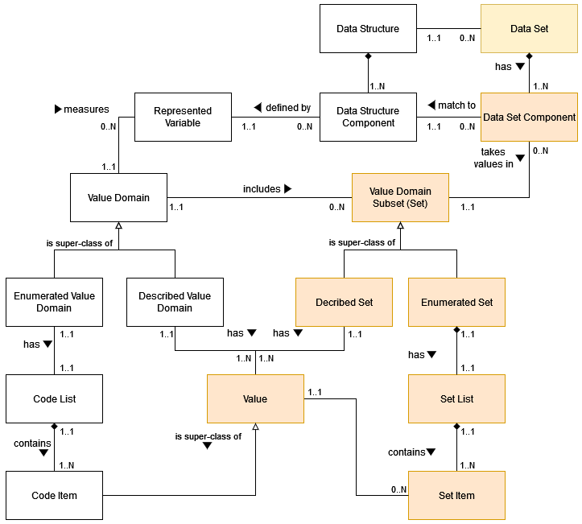

=============================================
Table Example (UM 923-932)
=============================================

   *Production of the American Countries*

+--------------+-------------+---------------+----------------+--------------+
| **Ref.Date** | **Country** | **Meas.Name** | **Meas.Value** | **Status**   |
|              |             |               |                |              |
+==============+=============+===============+================+==============+
| 2013         | Canada      | Population    | 50             | Final        |
+--------------+-------------+---------------+----------------+--------------+
| 2013         | Canada      | GNP           | 600            | Final        |
+--------------+-------------+---------------+----------------+--------------+
| 2013         | USA         | Population    | 250            | Temporary    |
+--------------+-------------+---------------+----------------+--------------+
| 2013         | USA         | GNP           | 2400           | Final        |
+--------------+-------------+---------------+----------------+--------------+
| …            | …           | …             | …              | …            |
+--------------+-------------+---------------+----------------+--------------+
| 2014         | Canada      | Population    | 51             | Unavailable  |
+--------------+-------------+---------------+----------------+--------------+
| 2014         | Canada      | GNP           | 620            | Temporary    |
+--------------+-------------+---------------+----------------+--------------+
| …            | …           | …             | …              | …            |
+--------------+-------------+---------------+----------------+--------------+

==========================================================================================
Paragraph + Diagram + List Example (UM 1042-1184)
==========================================================================================
This Section provides a formal model for the Variables, the Value Domains, their Values and the possible (Sub)Sets of Values. 
These artefacts can be referenced in the definition of the VTL Data Structures and as parameters of some VTL Operators.

-------------------------------------------------------
Variable and Value Domain model diagram (with Mermaid)
-------------------------------------------------------

.. mermaid::

    classDiagram
        SetItem "0..N" -- "1..1" Value
        SetItem "1..N" --* "1..1" SetList 
        SetList "1..1" -- "1..1" EnumeratedSet
        
        CodeItem --|> Value
        CodeItem "1..N" --* "1..1" CodeList 
        CodeList "1..1" -- "1..1" EnumeratedValueDomain
        
        Value "1..N" -- "1..1" DescribedValueDomain
        Value "1..N" -- "1..1" DescribedSet
        
        DescribedValueDomain --|> ValueDomain
        EnumeratedValueDomain --|>  ValueDomain
        
        EnumeratedSet --|> ValueDomainSubset
        DescribedSet --|> ValueDomainSubset
        ValueDomain "1..1" -- "0..N" ValueDomainSubset
        ValueDomain "1..1" -- "0..N" RepresentedVariable
        
        DataStructure "1..1" -- "0..N" DataSet
        DataStructure *-- "1..N" DataStructureComponent
        DataSet *-- "1..N" DataSetComponent
        DataSetComponent "0..N" -- "1..1" DataStructureComponent
        ValueDomainSubset "1..1" -- "0..N" DataSetComponent
        RepresentedVariable "1..1" -- "0..N" DataStructureComponent

--------------------------------------------------------
Variable and Value Domain model diagram (with PlantUML)
--------------------------------------------------------

.. uml::

    @startuml
            skinparam SameClassWidth true
            skinparam linetype ortho

            SetItem "0..N" -u- "1..1" Value
            SetItem "1..N" -u-* "1..1" SetList
            SetList "1..1" -u- "1..1" EnumeratedSet
    
            CodeItem -u-|> Value
            CodeItem "1..N" -u-* "1..1" CodeList
            CodeList "1..1" -u- "1..1" EnumeratedValueDomain
    
            Value "1..N" -u- "1..1" DescribedValueDomain
            Value "1..N" -u- "1..1" DescribedSet
    
            DescribedValueDomain -u-|> ValueDomain
            EnumeratedValueDomain -u-|>  ValueDomain
    
            EnumeratedSet -u-|> ValueDomainSubset
            DescribedSet -u-|> ValueDomainSubset
            ValueDomain "1..1" -r- "0..N" ValueDomainSubset
            ValueDomain "1..1" -u- "0..N" RepresentedVariable
    
            DataStructure "1..1" -r- "0..N" DataSet
            DataStructure *-- "1..N" DataStructureComponent
            DataSet *-d- "1..N" DataSetComponent
            DataSetComponent "0..N" -l- "1..1" DataStructureComponent
            ValueDomainSubset "1..1" -u- "0..N" DataSetComponent
            RepresentedVariable "1..1" -r- "0..N" DataStructureComponent
    @enduml

--------------------------------------------------------
Variable and Value Domain model diagram (with PlantUML and packages)
--------------------------------------------------------

.. uml::

  @startuml      
  class Value
            class RepresentedVariable 
            package domain { 
            class ValueDomain
            class DescribedValueDomain 
            class EnumeratedValueDomain 
            class CodeItem 
            class CodeList
            } 
            package set { 
            class DescribedSet 
            class EnumeratedSet 
            class ValueDomainSubset
            class SetItem 
            class SetList
            }     
            package items {       
            class DataSet 
            class DataStructure 
            class DataSetComponent
            class DataStructureComponent
            }
            SetList "1..1" -- "1..1" EnumeratedSet
            SetItem "1..N" --* "1..1" SetList
            CodeItem --|> Value
            CodeItem "1..N" --* "1..1" CodeList
            CodeList "1..1" -- "1..1" EnumeratedValueDomain

            Value "1..N" -- "1..1" DescribedValueDomain
            Value "1..N" -- "1..1" DescribedSet

            DescribedValueDomain --|> ValueDomain
            EnumeratedValueDomain --|>  ValueDomain

            EnumeratedSet --|> ValueDomainSubset
            DescribedSet --|> ValueDomainSubset
            ValueDomain "1..1" -- "0..N" ValueDomainSubset
            ValueDomain "1..1" -- "0..N" RepresentedVariable

            DataStructure "1..1" -- "0..N" DataSet
            DataStructure *-- "1..N" DataStructureComponent
            DataSetComponent "1..N"--* DataSet 
            DataSetComponent "0..N" -- "1..1" DataStructureComponent
            ValueDomainSubset "1..1" -- "0..N" DataSetComponent
            RepresentedVariable "1..1" -- "0..N" DataStructureComponent
  @enduml

--------------------------------------------------------
Variable and Value Domain model diagram (with draw.io)
--------------------------------------------------------

PNG

..   :width: 400
..   :alt: Alternative text

SVG

.. image:: ./VTL_1046.drawio.svg
..   :width: 400
..   :alt: Alternative text

------------------------------
Explanation of the Diagram
------------------------------
Even in the case of Variables and Value Domains, the GSIM artefacts are used as much as possible. The differences are mainly due 
to the fact that GSIM does not distinguish explicitly between Value Domains and their (Sub)Sets, while in the VTL IM this is made more explicit in
order to allow different Data Set Components relevant to the same aspect of the reality (e.g. the geographic area) to share the same Value Domain and, 
at the same time, to take values in different Subsets of it. This is essential for VTL for several operations and in particular for validation purposes. 

For example, it may happen that the same Represented Variable, say the “place of birth”, in a Data Set takes values in the Set of the European Counties, 
in another one takes values in the set of the African countries, and so on, even at different levels of details (e.g. the regions, the cities). 
The definition of the exact Set of Values that a Data Set Component can take may be very important for VTL, in particular for validation purposes.
The specification of the Set of Values that the Data Set Components may assume is equivalent, on the mathematical plane, 
to the specification of the domain and the co-domain of the mathematical function corresponding to the Data Set.

**Data Set:** see the explanation given in the previous section (Generic Model for Data and their structures).

**Data Set Component:** a component of the Data Set, which matches with just one Data Structure Component of the Data Structure 
of such a Data Set and takes values in a (sub)set of the corresponding Value Domain13; this (sub)set of allowed values may either coincide with
the set of all the values belonging to the Value Domain or be a proper subset of it. In respect to a Data Structure Component, 
a Data Set Component bears the important additional information of the set of allowed values of the Component, which can be different Data Set by
Data Set even if their data structure is the same.

**Data Structure**: a Data Structure; see the explanation already given
in the previous section (Generic Model for Data and their structures)

**Data Structure Component**: a component of a Data Structure; see the
explanation already given in the previous section (Generic Model for
Data and their structures). A Data Structure Component is defined by a
Represented Variable.

**Represented Variable**: a characteristic of a statistical population
(e.g. the country of birth) represented in a specific way (e.g. through
the ISO code). This artefact is the same as in GSIM. A represented
variable may take value in (or may be measured by) just one Value
Domain.

**Value Domain**: the domain of allowed values for one or more
represented variables. This artefact is very similar to the
corresponding artefact in GSIM. Because of the distinction between Value
Domain and its Value Domain Subsets, a Value Domain is the wider set of
values that can be of interest for representing a certain aspect of the
reality like the time, the geographical area, the economic sector and so
on. As for the mathematical meaning, a Value Domain is meant to be the
representation of a “space of events” with the meaning of the
probability theory [14]_. Therefore, a single Value of a Value Domain is
a representation of a single “event” belonging to this space of events.

**Described Value Domain**: a Value Domain defined by a criterion
(e.g. the domain of the positive integers). This artefact is the same
as in GSIM.

    **Enumerated Value Domain**: a Value Domain defined by enumeration of
    the allowed values (e.g. domain of ISO codes of the countries). This
    artefact is the same as in GSIM.
    
    **Code List**: the list of all the Code Items belonging to an
    enumerated Value Domain, each one representing a single “event” with
    the meaning of the probability theory. As for its mathematical
    meaning, this list is unique for a Value Domain, cannot contain
    repetitions (each Code Item can be present just once) and cannot
    contain ambiguities (each Code Item must have a univocal meaning,
    i.e., must represent a single event of the space of the events). This
    artefact is the same as in GSIM except for the multiplicity of the
    relationship with the Enumerated Value Domain which is 1:1. In fact,
    as it happens for the Data Set, the VTL considers the Code List as an
    artefact at a logical level, corresponding to its mathematical
    meaning. A logical VTL Code List, however, may be obtained as the
    composition of more physical lists of codes if needed: the mapping
    between the logical and the physical lists is out of scope of this
    document and is left to the implementations, provided that the basic
    conceptual properties of the VTL Code List are ensured (unicity, no
    repetitions, no ambiguities). In practice, as for the VTL IM, the
    Code List artefact matches 1:1 with the Enumerated Value Domain
    artefact, therefore they can be considered as the same artefact.
    
    **Code Item**: an allowed Value of an enumerated Value Domain. A Code
    Item is the association of a Value with the relevant meaning (called
    “category” in GSIM). An example of Code Item is a single country ISO
    code (the Value) associated to the country it represents (the category).
    As for the mathematical meaning, a Code Item is the representation of an
    “event” of a space of events (i.e. the relevant Value Domain), according
    to the notions of “event” and “space of events” of the probability
    theory (see the note above).

**Value**: an allowed value of a Value Domain. Please note that on a
logical / mathematical level, both the Described and the Enumerated
Value Domains contain Values, the only difference is that the Values of
the Enumerated Value Domains are explicitly represented by enumeration,
while the Values of the Described Value Domains are implicitly
represented through a criterion.

The following artefacts are aimed at representing possible subsets of
the Value Domains. This is needed for validation purposes, because very
often not all the values of the Value Domain are allowed in a Data
Structure Component, but only a subset of them (e.g. not all the
countries but only the European countries). This is needed also for
transformation purposes, for example to filter the Data Points according
to a subset of Values of a certain Data Structure Component (e.g.
extract only the European Countries from some data relevant to the World
Countries). Although this detail does not exist in GSIM, these artefacts
are compliant with the GSIM artefacts described above, aimed at
representing the Value Domains:

**Value Domain Subset** (or simply **Set**): a subset of Values of a
Value Domain. This artefact does not exist in GSIM; however, it is
compliant with the GSIM Value Domain. Hereinafter a Value Domain Subset
is simply called **Set**, because it can be any set of Values belonging
to the Value Domain (even the set of all the values of the Value
Domain).

    **Described Value Domain Subset** (or simply **Described Set**): a
    described (defined by a criterion) subset of Values of a Value Domain
    (e.g. the countries having more than 100 million inhabitants, the
    integers between 1 and 100). This artefact does not exist in GSIM;
    however, it is compliant with the GSIM Described Value Domain.
    
    **Enumerated Value Domain** **Subset** (or simply **Enumerated
    Set**): an enumerated subset of a Value Domain (e.g. the enumeration
    of the European countries). This artefact does not exist in GSIM;
    however, it is compliant with the GSIM Enumerated Value Domain.
    
    **Set List**: the list of all the Values belonging to an Enumerated
    Set (e.g. the list of the ISO codes of the European countries),
    without repetitions (each Value is present just once). As obvious,
    these Values must belong to the Value Domain of which the Set is a
    subset. This artefact does not exist in GSIM; however, it is
    compliant with the Code List in GSIM, which has a similar role. The
    Set List enumerates the Values contained in the Set (e.g. the
    European country codes), without the associated categories (e.g. the
    names of the countries), because the latter are already maintained in
    the Code List / Code Items of the relevant Value Domain (which
    enumerates all the possible Values with the associated categories).
    In practice, as for the VTL IM, the Set List artefact coincides 1:1
    with the Enumerated Set artefact, therefore they can be considered as
    the same artefact.

**Set Item**: an allowed Value of an enumerated Set. The Value must
belong to the same Value Domain the Set belongs to. Each Set Item refers
to just one Value and just one Set. A Value can belong to any number of
Sets. A Set can contain any number of Values.

